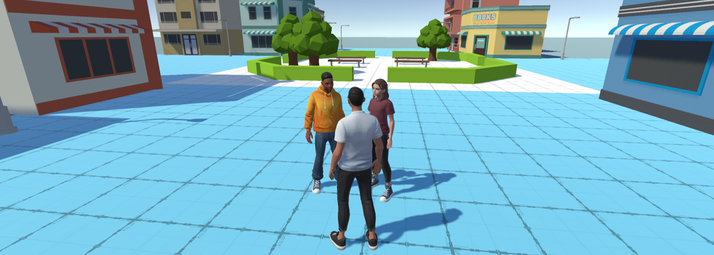

<p align="center">
  
</p>

# Implementing the MPAI Metaverse Model Architecture
This project presents a prototype implementation of the MMM architecture.

* [Introduction](#introduction)
* [Builds and Building](#builds)
* [Citation](#citation)

## Introduction
This implementation is not intended as ``just another'' alternative metaverse platform but serves three critical purposes: i) validating the proposed standards through practical applications, ii) creating an open platform that can be offered to the community, and iii) acting as a source of insights and suggestions for extending the standards themselves.

## Builds and Building
The project was developed and tested using [**Unity 2022.3.x (LTS)**](https://unity3d.com/unity/qa/lts-releases?version=2021.3)

## Citation
Please cite this paper in your publications if it helps your research.
```bibtex
  @inproceedings{cannavo2025implementing,
  title={Implementing the MPAI Metaverse Model Architecture},
  author={Cannavo', Alberto and Visconti, Alessandro and Chiariglione, Leonardo and Kudumakis, Panos and Chollet, G{\'e}rard and Sansen, Hugues and Menezes, Paulo and Lamberti, Fabrizio},
  booktitle={IEEE Conference on Virtual Reality and 3D User Interfaces Abstracts and Workshops},
  year={2025},
  organization={IEEE}}

